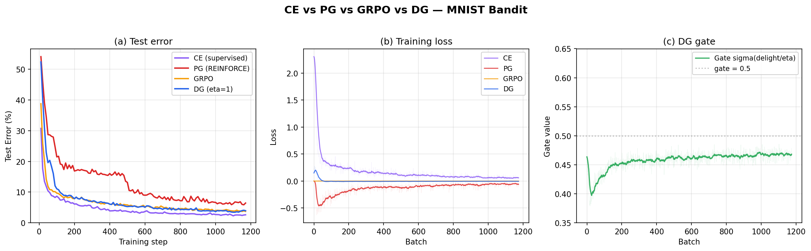

# Examples

TorchTrade provides a collection of example training scripts to help you get started. These examples are designed for **inspiration and learning** - use them as starting points to build your own custom training pipelines.

## Design Philosophy

TorchTrade examples closely follow the structure of [TorchRL's SOTA implementations](https://github.com/pytorch/rl/tree/main/sota-implementations), enabling **near plug-and-play compatibility** with any TorchRL algorithm. This means:

- Familiar structure if you've used TorchRL before
- Easy adaptation of TorchRL algorithms to trading environments
- Minimal boilerplate - focus on what's unique to your strategy
- Hydra configuration for easy experimentation

---

## Direct Compatibility with TorchRL SOTA Implementations

To demonstrate the closeness to TorchRL's [SOTA implementations](https://github.com/pytorch/rl/tree/main/sota-implementations), here is a direct comparison:

**TorchRL's A2C Example:**
```python
from torchrl.envs import GymEnv

# Environment setup
env = GymEnv("CartPole-v1")

# Everything else stays the same
collector = SyncDataCollector(env, policy, ...)
loss_module = A2CLoss(actor, critic, ...)
optimizer = torch.optim.Adam(loss_module.parameters(), lr=1e-3)

for batch in collector:
    loss_values = loss_module(batch)
    loss_values["loss"].backward()
    optimizer.step()
```

**TorchTrade Adaptation (Only Environment Changes):**
```python
from torchtrade.envs.offline import SequentialTradingEnv, SequentialTradingEnvConfig

# Environment setup - ONLY CHANGE
env = SequentialTradingEnv(df, SequentialTradingEnvConfig(...))

# Everything else stays EXACTLY the same
collector = SyncDataCollector(env, policy, ...)
loss_module = A2CLoss(actor, critic, ...)
optimizer = torch.optim.Adam(loss_module.parameters(), lr=1e-3)

for batch in collector:
    loss_values = loss_module(batch)
    loss_values["loss"].backward()
    optimizer.step()
```

**That's it!** The collector, loss function, optimizer, and training loop remain identical. This doesn't only allow the use of any TorchRL algorithm, but any of the other useful components of TorchRL - replay buffers, transforms, modules, data structures - and provides seamless integration into the entire TorchRL ecosystem.

---

## Example File Structure

Each algorithm directory is fully self-contained — configs, scripts, and all training outputs (checkpoints, logs, Hydra outputs) are written to that directory:

```
examples/online_rl/
├── <algorithm>/                      # ppo, dqn, dsac, iql, ppo_chronos
│   ├── config.yaml                   # Algorithm config
│   ├── env/                          # Environment configs
│   │   ├── sequential.yaml           # Basic sequential trading
│   │   └── sequential_sltp.yaml      # Sequential with stop-loss/take-profit
│   ├── train.py                      # Training script (offline backtesting)
│   ├── live.py                       # Live trading script (optional)
│   ├── utils.py                      # Helper functions
│   └── outputs/                      # Hydra outputs, checkpoints, logs
│
└── grpo/                             # GRPO (onestep-only)
    ├── config.yaml                   # Algorithm config
    ├── env/
    │   └── onestep.yaml              # One-step environment config
    ├── train.py
    ├── utils.py
    └── outputs/
```

**Key Features:**

- Each algorithm directory is **self-contained** — everything you need to run, train, and deploy lives in one place

- Training outputs (checkpoints, logs) are written to the algorithm's own directory

- **GRPO** only supports onestep environments

- **No spot/futures split** - users override `leverage` and `action_levels` for 
futures

- **All use 1Hour timeframe** by default

### What Each Component Does

**`config.yaml` - Configuration Management**

The configuration file uses [Hydra](https://hydra.cc/) to manage all hyperparameters and settings. This includes:

- **Environment settings**: Symbol, timeframes, initial cash, transaction fees, window sizes
- **Network architecture**: Hidden dimensions, activation functions, layer configurations
- **Training hyperparameters**: Learning rate, batch size, discount factor (gamma), entropy coefficient
- **Collector settings**: Frames per batch, number of parallel environments
- **Logging**: Wandb project name, experiment tracking settings

By centralizing all parameters in YAML, you can easily experiment with different configurations without modifying code. Hydra also allows you to override any parameter from the command line:

```bash
# Override multiple parameters
python train.py env.symbol="ETH/USD" optim.lr=1e-4 loss.gamma=0.95
```

**Example config.yaml** (PPO):
```yaml
defaults:
  - env: sequential          # Load env/sequential.yaml (switch with env=sequential_sltp)
  - _self_

collector:
  device:
  frames_per_batch: 10000
  total_frames: 100_000_000

logger:
  mode: online
  backend: wandb
  project_name: TorchTrade-Online
  group_name: ${env.name}
  exp_name: ppo-${env.name}
  test_interval: 1_000_000
  num_test_episodes: 1

model:
  network_type: batchnorm_mlp
  hidden_size: 128
  dropout: 0.1
  num_layers: 4

optim:
  lr: 2.5e-4
  eps: 1.0e-6
  weight_decay: 0.0
  max_grad_norm: 0.5
  anneal_lr: True
  device:

loss:
  gamma: 0.9
  mini_batch_size: 3333
  ppo_epochs: 3
  gae_lambda: 0.95
  clip_epsilon: 0.1
  anneal_clip_epsilon: True
  critic_coeff: 1.0
  entropy_coeff: 1.0
  loss_critic_type: l2
```

Note how `config.yaml` uses `defaults: - env: sequential` to load the environment config from `env/sequential.yaml`. The env section is kept separate — see the `env/` configs above.

**`env/` - Environment Configs**

Environment configs are separate YAML files that define the trading environment. Switch environments via CLI with `env=sequential_sltp` (see [Running Examples](#running-examples)).

**`env/sequential.yaml`** — Basic sequential trading (`SequentialTradingEnv`):
```yaml
# @package env
name: SequentialTradingEnv
symbol: "BTC/USD"
time_frames: ["1Hour"]
window_sizes: [24]
execute_on: "1Hour"
leverage: 2
action_levels: [-1.0, 0.0, 1.0]
initial_cash: 10000
transaction_fee: 0.0
slippage: 0.0
bankrupt_threshold: 0.1
include_base_features: false
max_traj_length: null
random_start: true
margin_type: isolated
maintenance_margin_rate: 0.004
seed: 0
train_envs: 5
eval_envs: 1
data_path: Torch-Trade/btcusdt_spot_1m_03_2023_to_12_2025
test_split_start: "2025-01-01"
```

**`env/sequential_sltp.yaml`** — Sequential with stop-loss/take-profit (`SequentialTradingEnvSLTP`):
```yaml
# @package env
name: SequentialTradingEnvSLTP
symbol: "BTC/USD"
time_frames: ["1Hour"]
window_sizes: [24]
execute_on: "1Hour"
leverage: 1
action_levels: [0.0, 1.0]
stoploss_levels: [-0.01, -0.02, -0.03, -0.04]
takeprofit_levels: [0.02, 0.04, 0.06, 0.08, 0.1]
include_hold_action: true
include_close_action: false
initial_cash: 10000
transaction_fee: 0.0
slippage: 0.0
bankrupt_threshold: 0.1
include_base_features: false
max_traj_length: null
random_start: true
margin_type: isolated
maintenance_margin_rate: 0.004
seed: 0
train_envs: 10
eval_envs: 1
data_path: Torch-Trade/btcusdt_spot_1m_03_2023_to_12_2025
test_split_start: "2025-01-01"
```

**`env/onestep.yaml`** — One-step environment for GRPO (`OneStepTradingEnv`):
```yaml
# @package env
name: OneStepTradingEnv
symbol: "BTC/USD"
time_frames: ["1Hour"]
window_sizes: [24]
execute_on: "1Hour"
leverage: 1
initial_cash: 10000
transaction_fee: 0.0
slippage: 0.0
bankrupt_threshold: 0.1
stoploss_levels: [-0.02]
takeprofit_levels: [0.04]
include_hold_action: true
seed: 0
train_envs: 6
eval_envs: 1
data_path: Torch-Trade/btcusdt_spot_1m_03_2023_to_12_2025
test_split_start: "2025-01-01"
```

**`utils.py`** - Helper functions (`make_env()`, `make_actor()`, `make_critic()`, `make_loss()`, `make_collector()`) that keep the training script clean.

**`train.py`** - Main training loop: loads config via Hydra, creates components, collects data, trains, evaluates, and checkpoints.

**`live.py`** - Live trading script that loads a trained policy and executes it against a live exchange API. The DQN and PPO examples include `live.py` to demonstrate the smooth transition from backtesting/training to live execution — the same policy trained offline can be deployed directly to a live environment with minimal code changes.

---

## Available Examples

The following examples demonstrate the flexibility of TorchTrade across different algorithms, environments, and use cases. These examples are meant to be starting points for further experimentation and adaptation - customize them according to your needs, ideas, and environments.

!!! warning "Hyperparameters Not Tuned"
    **All hyperparameters in our examples are NOT tuned.** The configurations provided are starting points for experimentation, not optimized settings. You should tune hyperparameters (learning rates, network architectures, reward functions, etc.) according to your specific trading environment, market conditions, and objectives.

### Online RL (Offline Backtesting Environments)

These examples use online RL algorithms (learning from interaction as it happens) with historical market data for backtesting. This allows you to train policies on past data before deploying them to live trading environments. We typically split the training data into training and test environments to evaluate the generalization performance of learned policies on unseen market conditions.

Located in `examples/online_rl/`:

- **[PPO](https://arxiv.org/abs/1707.06347)** - `ppo/` - Standard policy gradient
- **[PPO](https://arxiv.org/abs/1707.06347) + [Chronos](https://arxiv.org/abs/2403.07815)** - `ppo_chronos/` - Time series embedding with Chronos T5 models
- **[DQN](https://arxiv.org/abs/1312.5602)** - `dqn/` - Deep Q-learning with experience replay and target networks
- **[IQL](https://arxiv.org/abs/2110.06169)** - `iql/` - Implicit Q-Learning
- **[Discrete SAC](https://arxiv.org/abs/1910.07207)** - `dsac/` - Discrete Soft Actor-Critic
- **[GRPO](https://arxiv.org/abs/2402.03300)** - `grpo/` - Group Relative Policy Optimization (onestep-only, no env switching)

All algorithms except GRPO support environment switching via CLI - see [Running Examples](#running-examples) below.

### Offline RL

These examples use offline RL algorithms that learn from pre-collected datasets without requiring live environment interaction during training. The data can be collected from interactions with offline backtesting environments or from real online live trading sessions. We provide simple example offline datasets at [HuggingFace/Torch-Trade](https://huggingface.co/Torch-Trade).

Located in `examples/offline_rl/`:

| Example | Algorithm | Environment | Key Features |
|---------|-----------|-------------|--------------|
| **iql/** | IQL | SequentialTradingEnv | Offline RL from pre-collected trajectories |

**Note**: Thanks to the compatibility with TorchRL, you can easily add other offline RL methods like CQL, TD3+BC, and Decision Transformers from TorchRL to do offline RL with TorchTrade environments.

### LLM Actors

TorchTrade provides LLM-based trading actors that leverage language models for trading decision-making. Both frontier API models and local models are supported, each with offline (backtesting) and online (live trading) examples.

Located in `examples/llm/`:

| Example | Actor | Description |
|---------|-------|-------------|
| **frontier/offline.py** | [FrontierLLMActor](https://github.com/TorchTrade/torchtrade/blob/main/torchtrade/actor/frontier_llm_actor.py) | Backtesting with frontier LLM APIs (OpenAI, Anthropic, etc.) |
| **frontier/live.py** | [FrontierLLMActor](https://github.com/TorchTrade/torchtrade/blob/main/torchtrade/actor/frontier_llm_actor.py) | Live trading with frontier LLM APIs |
| **local/offline.py** | [LocalLLMActor](https://github.com/TorchTrade/torchtrade/blob/main/torchtrade/actor/local_llm_actor.py) | Backtesting with local LLMs (vLLM/transformers) |
| **local/live.py** | [LocalLLMActor](https://github.com/TorchTrade/torchtrade/blob/main/torchtrade/actor/local_llm_actor.py) | Live trading with local LLMs |

Local models can be loaded from [HuggingFace Models](https://huggingface.co/models) or quantized via [Unsloth](https://unsloth.ai/) for memory-efficient inference.

!!! note "Future Work"
    Fine-tuning LLMs on reasoning traces from frontier models, and integrating Vision-Language Models (VLMs) to process trading chart plots.

### Rule-Based Actors

TorchTrade provides [RuleBasedActor](https://github.com/TorchTrade/torchtrade/blob/main/torchtrade/actor/rulebased/base.py) for creating trading strategies using technical indicators and market signals. These actors integrate seamlessly with TorchTrade environments for both backtesting and live trading, serving as baselines or components in hybrid approaches.

Located in `examples/rule_based/`:

| Example | Description |
|---------|-------------|
| **offline.py** | Backtesting a mean reversion strategy on historical data |
| **live.py** | Live trading with the mean reversion strategy |

Combine with **[custom feature preprocessing](../guides/custom-features.md)** to add technical indicators for rule-based strategies.

!!! note "Future Work"
    Hybrid approaches that combine rule-based policies with neural network policies as actors, leveraging the strengths of both deterministic strategies and learned behaviors.

### Loss Function Examples

Standalone scripts that compare TorchTrade's custom loss functions against baselines on simple tasks, useful for sanity checking and understanding each loss.

Located in `examples/losses/`:

| Example | Loss | Description |
|---------|------|-------------|
| **dg_mnist.py** | [DGLoss](../components/losses.md#dgloss) | Compares CE, REINFORCE, and DG on MNIST-as-bandit. Plots test error, training loss, and gate dynamics. |



All policy gradient methods converge well below 10% after 5 epochs. CE (purple, 2.6%) is the supervised upper bound. GRPO (amber, 3.7%) and DG (blue, 3.9%) both approach CE, while REINFORCE (red, 6.4%) lags behind. GRPO uses G=32 group generation with per-image advantage normalization. DG achieves comparable results without importance sampling. Panel (c) shows the DG gate settling near 0.5 as the policy improves.

```bash
# Run with defaults (5 epochs, eta=1.0, mean baseline)
python examples/losses/dg_mnist.py

# Sweep eta temperature
python examples/losses/dg_mnist.py --eta 0.3

# Skip plotting
python examples/losses/dg_mnist.py --no-plot
```

### Live Trading

The DQN and PPO examples include a `live.py` script alongside the `train.py` script, demonstrating the smooth transition from offline backtesting to live trading. The same model architecture and `utils.py` helpers are reused — only the environment changes from an offline `SequentialTradingEnv` to a live exchange environment. This mirrors the core design philosophy: **swap the environment, keep everything else the same.**

Live scripts support loading pre-trained weights via `--weights` and store all live transitions in a replay buffer (saved periodically for crash safety), enabling offline analysis or further training on real market data.

Located alongside each algorithm in `examples/online_rl/`:

| Example | Exchange | Algorithm | Description |
|---------|----------|-----------|-------------|
| **dqn/live.py** | Binance Futures | DQN | Live futures trading with DQN |
| **ppo/live.py** | Alpaca | PPO | Live spot trading with PPO actor |

**Usage:**
```bash
# Train offline first
python examples/online_rl/dqn/train.py

# Deploy trained weights to Binance testnet
python examples/online_rl/dqn/live.py --weights dqn_policy_100.pth --demo

# Deploy PPO to Alpaca paper trading
python examples/online_rl/ppo/live.py --weights ppo_policy_100.pth --paper
```

### Transforms

Inspired by work such as [R3M](https://arxiv.org/abs/2203.12601) and [VIP](https://arxiv.org/abs/2210.00030) that utilize large pretrained models for representation learning, we created the ChronosEmbeddingTransform using [Chronos forecasting models](https://github.com/amazon-science/chronos-forecasting) to embed historical trading data. This demonstrates the flexibility and adaptability of TorchTrade for integrating pretrained models as transforms for enhanced feature representations.

Located in `examples/transforms/`:

| Example | Transform | Description |
|---------|-----------|-------------|
| **chronos_embedding_example.py** | ChronosEmbeddingTransform | Time series embedding with Chronos T5 models |

**Note**: If you would like us to add additional transforms for other pretrained models (similar to ChronosEmbedding), we welcome [GitHub issues](https://github.com/TorchTrade/torchtrade/issues) with your requests. We're happy to implement these given the availability of model weights and resources.

---

## Running Examples

All examples use Hydra for configuration management with centralized environment configs:

```bash
# Run with default configuration (sequential, spot, 1Hour)
uv run python examples/online_rl/ppo/train.py

# Switch environment via CLI
uv run python examples/online_rl/ppo/train.py env=sequential_sltp
uv run python examples/online_rl/ppo/train.py env=onestep

# Configure for futures trading
uv run python examples/online_rl/ppo/train.py \
    env.leverage=5 \
    env.action_levels='[-1.0,0.0,1.0]'

# Override multiple parameters
uv run python examples/online_rl/ppo/train.py \
    env=sequential_sltp \
    env.symbol="ETH/USD" \
    env.leverage=10 \
    optim.lr=1e-4 \
    loss.gamma=0.95
```

### Available Environment Configs

| Config | Environment Class | SLTP | Use Case |
|--------|-------------------|------|----------|
| `sequential` | SequentialTradingEnv | No | Basic sequential trading |
| `sequential_sltp` | SequentialTradingEnvSLTP | Yes | Sequential with bracket orders |
| `onestep` | OneStepTradingEnv | Yes | One-step for GRPO/contextual bandits |

**Spot vs Futures:**

- **Spot (default)**: `leverage: 1`, `action_levels: [0.0, 1.0]`

- **Futures**: Override with `env.leverage=5 env.action_levels='[-1.0,0.0,1.0]'`

### Common Hydra Overrides

| Parameter | Example | Description |
|-----------|---------|-------------|
| `env.symbol` | `"BTC/USD"` | Trading pair/symbol |
| `env.initial_cash` | `10000` | Starting capital |
| `env.time_frames` | `'["1min","5min"]'` | Multi-timeframe observations |
| `optim.lr` | `1e-4` | Learning rate |
| `loss.gamma` | `0.99` | Discount factor |
| `collector.frames_per_batch` | `2000` | Frames collected per iteration |
| `total_frames` | `100000` | Total training frames |

---

## Creating Your Own Examples

Copy an existing example closest to your use case and customize:

- Start with `ppo/` for standard RL, `grpo/` for one-step RL, `ppo_chronos/` for time series embeddings
- Use `env=<config_name>` to switch environments without copying code

